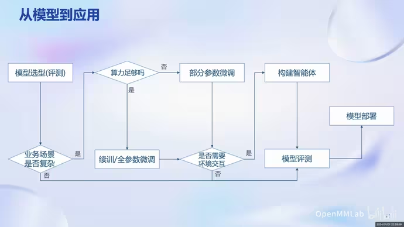

# Day 1: 大模型基础：以InternLM为例

<aside>
💡 感想：学习内容基本围绕书生展开，需要额外调研其他横向的大模型（待补充），也需要补充一些基本知识和常用技术（待补充），比如智能体、微调方法

</aside>

1. 大模型部署应用流程
    
    
    
2. 开源体系：数据-预训练框架-微调框架-部署工具-测评工具-agent应用工具箱
    1. 以InternLM为例
        
        
        
        - 数据：多模态融合，精细化处理，价值观对齐
            
            
            
        - 预训练框架：可扩展性，性能优化，兼容主流生态，开箱即用
            
            
            
        - **微调**：增量续训/有监督微调（LoRA）
            
            
            
            
            
        - **部署**：
            
            
            
            
            
        - 评测：
            
            
            
        - 应用：
            
            
            
            
            
            
            

Reference:

1. [手册](https://github.com/internLM/tutorial)
2. [视频](https://www.bilibili.com/video/BV1Rc411b7ns/)