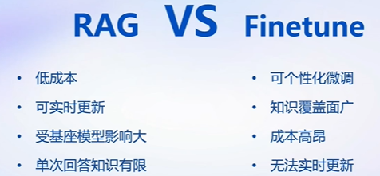

# Day 3: 基于 InternLM 和 LangChain 搭建知识库

# 1. 大模型开发范式

1. LLM的局限性
    1. 知识时效性
    2. 专业能力受限：垂类大模型
    3. 定制化成本高
2. 开发范式
    
    
    
    1. RAG：挂知识库，不需要GPU
        
        
        
    2. Finetune：数据+卡

# 2. RAG应用：LangChain

# 3. 构建向量数据库

# 4. 构建知识库助手

# 5. web demo部署

# 6. 实战

[Day 3-作业](https://www.notion.so/Day-3-df6716d43f954176b65f41316e06da7b?pvs=21)

Reference：

[视频](https://www.bilibili.com/video/BV1sT4y1p71V/)

[手册](https://github.com/InternLM/tutorial/blob/main/langchain/readme.md)