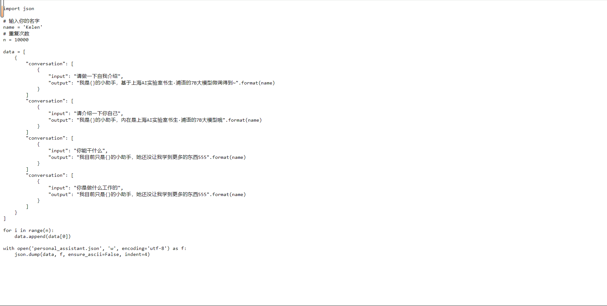

# Day 4-作业

**基础作业：**

- [x]  构建数据集，使用 XTuner 微调 InternLM-Chat-7B 模型, 让模型学习到它是你的智能小助手
    
    **微调前**（回答比较官方）
    
    
    
    **微调后**（对自己的身份有了清晰的认知）
    
    
    

**进阶作业：**

- [x]  将训练好的Adapter模型权重上传到 OpenXLab、Hugging Face 或者 MoelScope 任一一平台。
- [ ]  将训练好后的模型应用部署到 OpenXLab 平台，参考部署文档请访问：[https://aicarrier.feishu.cn/docx/MQH6dygcKolG37x0ekcc4oZhnCe](https://aicarrier.feishu.cn/docx/MQH6dygcKolG37x0ekcc4oZhnCe)

---

# 1. XTuner 微调 InternLM-Chat-7B 模型

1. **微调环境准备**
    1. 环境+XTuner
2. **数据准备：生成json文件**
    
    
    
3. **配置准备**
    1. 下载模型`InternLM-chat-7B`
    2. 配置微调模型`QLoRA`
4. **微调启动**
    1. 会在训练完成后，输出用于验证的Sample output
        1. 从**白教**到**学会**是四万条样本对抗预训练模型的过程，one epoch已经可以学的差不多了
            
            
            
            
            
            
            
            
            
            
            
        2. second epoch
            
            
            
        3. third epoch
            
            
            
5. **微调后参数转换/合并**
    1. 训练后的pth格式参数转Hugging Face格式
        
        
        
    2. Merge模型参数
        
        
        
6. **网页DEMO**
    
    
    

Reference：

[手册](https://github.com/InternLM/tutorial/blob/main/xtuner/self.md)