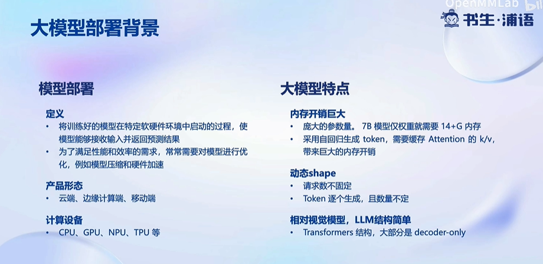

# Day 5: LMDeploy 大模型量化部署实践

# 1. 大模型部署背景

<aside>
💡 挑战：

- 部署：手机部署、工业终端无网部署 → llama.cpp
- 推理：动态推理 → continuous batch
- 内存：吞吐量，响应时间
</aside>

# 2. LMDeploy简介

- 非移动端
- 创新点：turbomind (C++)

<aside>
💡 量化好处

- 减少显存
- 加快推理速度
</aside>

- AWQ算法思想：重要参数不量化

# 3. 实践环节

1. 安装
2. 部署
    1. **模型转换**
        1. **在线转换**
            1. HuggingFace
            2. 直接启动本地的 Huggingface 模型
        2. **离线转换**
            1. 将模型转为 lmdeploy TurboMind 的格式
    2. **TurboMind 推理+命令行本地对话**
    3. **TurboMind推理+API服务**
    4. **网页 Demo 演示**
        1. **TurboMind 服务作为后端**
            - 直接启动作为前端的 Gradio
        2. **TurboMind 推理作为后端**
            - Gradio 也可以直接和 TurboMind 连接
    5. **TurboMind 推理 + Python 代码集成**
    6. **最佳实践**
        1. **方案实践**
            - 模型推理/服务：TurboMind
            
            
            
            - API 服务和 Client ：分场景
                - OpenAI 那样的 HTTP 接口服务：TurboMind推理 + API 服务
                - 演示 Demo：TurboMind 推理作为后端的Gradio进行演示
                - Python 项目中使用大模型功能：TurboMind推理 + Python
                - 非 Python 项目中使用大模型功能：TurboMind推理 + API 服务
        2. **模型配置实践（调参数）**
            - KV int8 开关`quant_policy`
            - 外推能力开关`rope_scaling_factor`
            - 批处理大小`max_batch_size`
3. 量化
    1. **KV Cache 量化**
        1. 计算 minmax
        2. 通过 minmax 获取量化参数。主要就是利用下面这个公式，获取每一层的 K V 中心值（zp）和缩放值（scale）。
        3. 修改配置
        4. 结论：*KV Cache 量化既能明显降低显存占用，还有可能同时带来精准度（Accuracy）的提升。*
    2. **W4A16 量化**
        1. 计算 minmax
        2. 量化权重模型
            - 缩放参数。主要是性能上的考虑（回顾 PPT）。
            - 整体量化。
        3. 结论：*W4A16 参数量化后能极大地降低显存，同时相比其他框架推理速度具有明显优势。*
    3. **最佳实践**
        1. 服务部署和量化是没有直接关联的，量化的最主要目的是降低显存占用，主要包括两方面的显存：模型参数和中间过程计算结果。
        2. 量化在降低显存的同时，一般还能带来性能的提升，因为更小精度的浮点数要比高精度的浮点数计算效率高，而整型要比浮点数高很多。

<aside>
💡 实践经验(项目开发)：

- 精度越高，显存占用越多，推理效率越低，但一般效果较好。
- Server 端推理一般用非量化版本或半精度、BF16、Int8 等精度的量化版本，比较少使用更低精度的量化版本。
- 端侧推理一般都使用量化版本，且大多是低精度的量化版本。这主要是因为计算资源所限。
</aside>

<aside>
💡 个人尝试：

- 如果资源足够（有GPU卡很重要），那就用非量化的正常版本。
- 如果没有 GPU 卡，只有 CPU（不管什么芯片），那还是尝试量化版本。
- 如果生成文本长度很长，显存不够，就开启 KV Cache。
</aside>

Reference:

[文档](https://github.com/InternLM/tutorial/blob/main/lmdeploy/lmdeploy.md)

[视频](https://www.bilibili.com/video/BV1iW4y1A77P)

