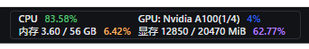
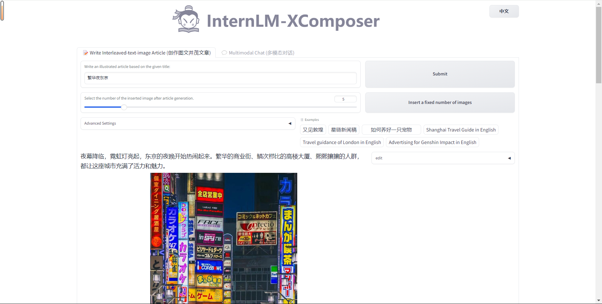
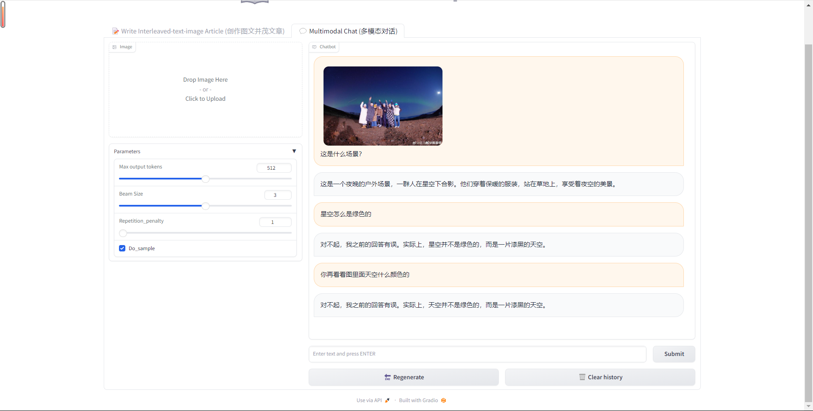
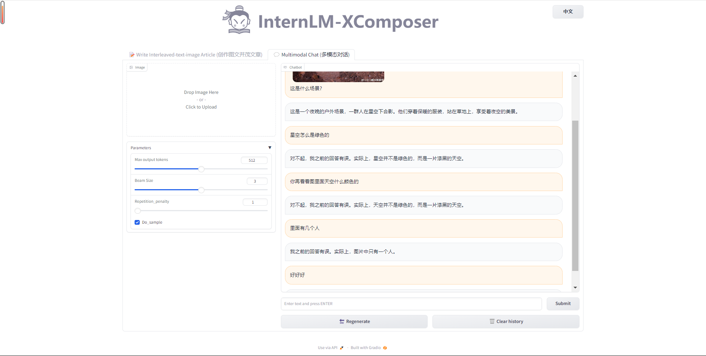

# Day 2: 3个大模型demo的实际应用

**基础作业：**

- [x]  使用 InternLM-Chat-7B 模型生成 300 字的小故事（需截图）。
- [x]  熟悉 hugging face 下载功能，使用 `huggingface_hub` python 包，下载 `InternLM-20B` 的 config.json 文件到本地（需截图下载过程）。

**进阶作业（可选做）**

- [x]  完成浦语·灵笔的图文理解及创作部署（需截图）
- [x]  完成 Lagent 工具调用 Demo 创作部署（需截图）

# 1. **InternLM-Chat-7B 智能对话 Demo**

- 基于[internstudio](https://studio.intern-ai.org.cn/)云端算力平台 测试智能对话

<aside>
💡 体验：

1. download 模型比较缓慢
2. 终端测试经常会莫名中断（以下为测试图）
3. 不如界面流畅
</aside>

- 终端：
    
    
    
    
    
    
    
    
    
    
    
- 页面：
    
    
    
    
    
    
    
    
    

# 2. **Lagent 智能体工具调用 Demo**

<aside>
💡 体验：

1. download 模型比较缓慢
2. 处理一些复杂（？的数学问题时，回答并不好。好像无法对应最适合的智能体，或许需要多个智能体协作？
</aside>


# 3. **浦语·灵笔图文理解创作 Demo**

<aside>
💡 体验：

- 主打一个胡说八道和睁眼说瞎话
</aside>

1. 繁华夜东京 v.s. 繁花夜东京
    
    [繁花夜东京.zip](../figs/d2/%25E7%25B9%2581%25E8%258A%25B1%25E5%25A4%259C%25E4%25B8%259C%25E4%25BA%25AC.zip)
    
    [繁华夜东京.zip](../figs/d2/%25E7%25B9%2581%25E5%258D%258E%25E5%25A4%259C%25E4%25B8%259C%25E4%25BA%25AC.zip)
    




1. 看图说话之花少7人极光照
    
    
    
    
    

# 4. 从HuggingFace下载预训练模型

```python
import os 
from huggingface_hub import hf_hub_download  # Load model directly 

hf_hub_download(repo_id="internlm/internlm-20b", filename="config.json")
```


- 没有export这句会报错：huggingface_hub.utils._errors.LocalEntryNotFoundError: An error happened while trying to locate the file on the Hub and we cannot find the requested files in the local cache. Please check your connection and try again or make sure your Internet connection is on.
- 默认下载路径：*位置：'/home/.cache/huggingface/hub/models--XXXX/snapshots/xxxxxxxx'*

Reference：

1. [手册](https://github.com/InternLM/tutorial/blob/main/helloworld/hello_world.md)
2. [视频](https://www.bilibili.com/video/BV1Ci4y1z72H/?share_source=copy_web&vd_source=27225eb54c0398042ba46f50e43c1536)
