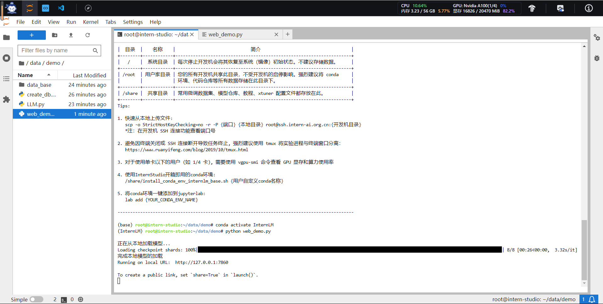

# Day 3-作业

**基础作业**：

- [x]  复现课程知识库助手搭建过程 (截图)

**进阶作业**：

- [x]  选择一个垂直领域，收集该领域的专业资料构建专业知识库，并搭建专业问答助手，
- [ ]  并在 [OpenXLab](https://openxlab.org.cn/apps) 上成功部署（截图，并提供应用地址）

### 1. 复现课程知识库助手搭建过程




### 2. 垂直领域专业问答助手搭建与部署

1. 数据收集
    1. [https://github.com/billvsme/law_ai/tree/master/Law-Book](https://github.com/billvsme/law_ai/tree/master/Law-Book)
2. 核心代码改动
    
    
    
    ```jsx
    python create_db.py #更新向量库
    ```
    
3. 部署
    
    ❎ OpenXLab与算力平台联动不好用
